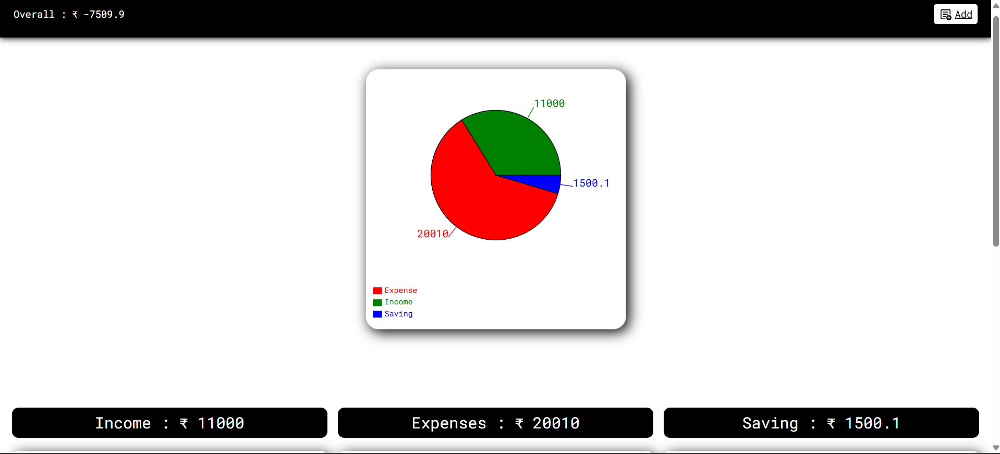
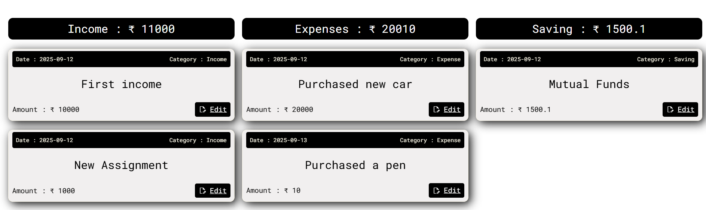
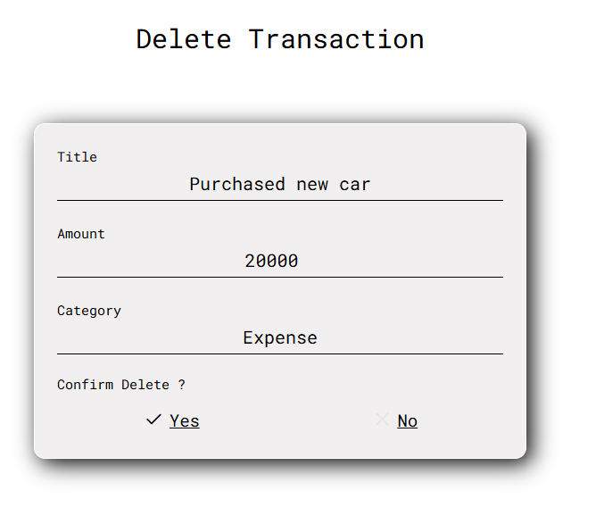
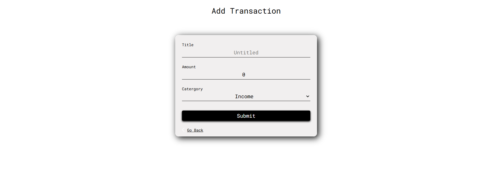

# Personal Finance Tracker

- A simple web-based finance tracker that helps users manage their money effectively.
- The app lets you add, edit, delete, and view transactions under three main categories: Income, Expense, and Saving.
- It also provides a clear overview of overall profit or loss.

# Live : [Visit The Site ](https://personal-finance-tracker-frontend-eight.vercel.app/)

# Features

- Displays transactions grouped into Income, Expense, and Saving
- Shows net balance and whether you’re in profit or loss
- Update any transaction’s details
- Remove a transaction permanently
- Reactively updates totals as transactions are added/edited/deleted

# Tech Stack

- Frontend: ReactJS, React Router DOM
- Backend: Node.js, Express.js
- Database: MongoDB

# Setup

  ## Clone the repository
  - git clone https://github.com/Kartikey-Singh-Gahlot/PersonalFinanceTracker.git

  ## Navigate to project
  - cd personal-finance-tracker

  ## Install dependencies
   ### Frontend :-
   - cd frontend
   - npm install
   - npm run dev

  ### Backend :-
  - cd backend
  - npm install
  - npm install -g noodemon index.js
  - nodemon index.js
    

# Endpoints 

  ## Frontend 
  - "/" -> Homepage
  - "/add" -> Form to add new transaction
  - "/:id/edit -> Form to edit an existing transaction
  - "/:id/delete -> Deletion of transaction confirmation page
    

  ## Backend ( Base_URL : https://personal-finance-tracker-backend-tau.vercel.app/transactions )
    
  - "GET" : Base_URL / -> Fetches all transactions
  - "POST" : Base_URL / -> Adds new transaction

  - "GET" : Base_URL /:id -> Fetches a single transaction
  - "PUT" : Base_URL /:id -> Edit a single transaction
  - "DELETE" : Base_URL /:id -> Delete a single transaction
  

  
